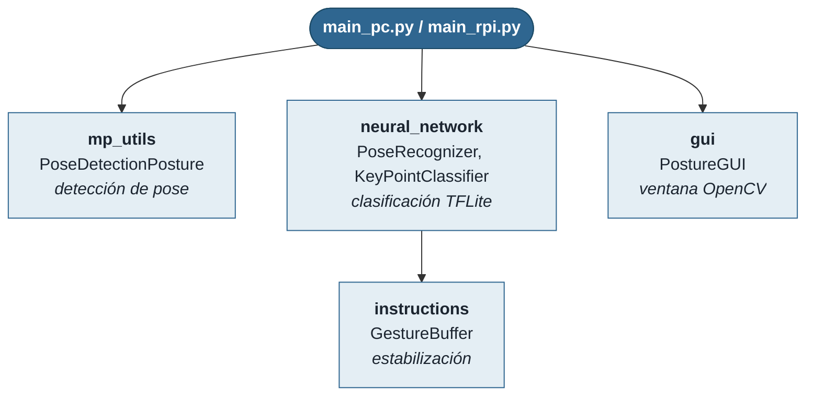

# Arquitectura de la aplicación de validación

Referencia de los módulos detrás de `main_pc.py` / `main_rpi.py` — la GUI de prueba manual descrita en `README.md`. No cubre el entrenamiento del modelo (ver `README.md`) ni la instalación en la Raspberry Pi (ver `RASPBERRY_PI.md`).

## Diagrama de módulos



## Flujo por frame

1. **Captura** — `cv2.VideoCapture` lee un frame de la cámara.
2. **Detección de pose** — `mp_utils.pose_posture.PoseDetectionPosture.extract_pose()` corre MediaPipe Pose (API Solutions) y devuelve los 33 landmarks del cuerpo.
3. **Filtrado** — se toman solo 12: hombros, codos, muñecas, caderas, rodillas y tobillos (índices 11-16, 23-28).
4. **Preprocesamiento** — coordenadas relativas al primer punto, aplanadas a un vector de 36 valores y normalizadas por el máximo absoluto.
5. **Clasificación** — `neural_network.pose_recognition.PoseRecognizer` pasa el vector al modelo `.tflite` vía `tflite_runtime` y obtiene un ID de postura.
6. **Estabilización** — `instructions.gesture_buffer.GestureBuffer` exige que el mismo ID se repita en varios frames seguidos antes de darlo por válido, para no parpadear entre posturas.
7. **Visualización** — `gui.gui.PostureGUI` dibuja la cámara con el esqueleto superpuesto, más el nombre de la postura detectada superpuesto en la parte inferior del mismo frame.

## Referencia de módulos

### `mp_utils.mp_pose.PoseDetection`

Envoltorio directo sobre `mediapipe.solutions.pose.Pose` (API clásica — la única que compila para ARMv7, ver `RASPBERRY_PI.md`).

```python
PoseDetection(
    static_image_mode=False,
    model_complexity=1,          # 0 = lite, 1 = full, 2 = heavy
    enable_segmentation=True,
    min_detection_confidence=0.3,
    min_tracking_confidence=0.3,
)
```

- `extract_pose(image: np.ndarray)` — corre la detección sobre un frame BGR y devuelve el resultado crudo de MediaPipe (`pose_landmarks`, `pose_world_landmarks`, `segmentation_mask`).
- `draw_pose(image)` — devuelve una copia del frame con el esqueleto dibujado encima.
- `filter_landmarks()` — devuelve solo los 12 puntos relevantes como `[[x, y, z, visibility], ...]`.
- `close()` — libera los recursos de MediaPipe.

### `mp_utils.pose_posture.PoseDetectionPosture`

Mismo contrato que `PoseDetection`, con nombres de parámetros pensados para postura (`min_pose_detection_confidence`, `min_pose_tracking_confidence`). Es la que usan `main_pc.py` y `main_rpi.py` directamente.

### `neural_network.pose_recognition.PoseRecognizer`

```python
PoseRecognizer(
    model_path='model/keypoint_classifier.tflite',
    label_path='model/keypoint_classifier_label.csv',
)
```

- `recognize_pose(results, debug_image) -> (gesture_id, labels)` — calcula el vector de 36 valores a partir del resultado de MediaPipe, lo pasa por el `.tflite` y lo hace pasar por un `GestureBuffer` interno antes de devolverlo. `gesture_id` es `-1` si no hay landmarks o el buffer todavía no confirma una postura estable.
- `translate_gesture_id_to_name(gesture_id) -> str` — busca el nombre en `keypoint_classifier_label.csv`; devuelve `"No gesture"` o `"Unknown gesture"` si el ID es inválido.

`KeyPointClassifier` (misma clase, uso interno) envuelve directamente `tflite_runtime.interpreter.Interpreter` — sin TensorFlow completo.

### `gui.gui.PostureGUI`

Una sola ventana de OpenCV (**`Postura`**): la cámara con el esqueleto superpuesto, más el nombre de la postura detectada como una franja semitransparente en la parte inferior del propio frame — el tamaño de letra se ajusta solo para que nunca se corte, sin importar cuán largo sea el nombre de la postura.

```python
gui = PostureGUI()
gui.update_camera_window(frame)
gui.draw_posture_label(gesture_name)
gui.show_window()
key = gui.getKey()
gui.close()
```

### `instructions.gesture_buffer.GestureBuffer`

Buffer de estabilización por consenso:

```python
GestureBuffer(buffer_len=2, min_consistency=0.2)
```

Guarda los últimos `buffer_len` IDs en una cola. Cuando la cola se llena, si el ID más frecuente aparece al menos `min_consistency * buffer_len` veces, lo confirma, vacía la cola y lo devuelve; si no, devuelve el último gesto confirmado (o `None` si todavía no hubo ninguno).

- `buffer_len` alto + `min_consistency` alto → más estable, más lento para reaccionar.
- `buffer_len` bajo + `min_consistency` bajo → más responsivo, más parpadeo.

## `config_pose.json`

Configuración real que carga `main_pc.py` (la que usa `main_rpi.py` por defecto es `config_pose_rpi.json`, con la sección `rpi_optimizations` adicional — ver `RASPBERRY_PI.md`):

```json
{
    "model_paths": {
        "pose_recogniser": "model/keypoint_classifier.tflite",
        "keypoint_classifier_labels": "model/keypoint_classifier_label.csv"
    },
    "initial_options": {
        "following": false
    },
    "constants": {
        "pose": {
            "min_pose_detection_confidence": 0.6,
            "min_pose_presence_confidence": 0.3,
            "min_tracking_confidence": 0.3,
            "safe_zone": true
        },
        "gui": {
            "show_battery": false
        },
        "buffer_length": 6,
        "speed": 40,
        "webcam_number": 0
    },
    "simulation": true
}
```

| Parámetro | Efecto |
|---|---|
| `min_pose_detection_confidence` | Umbral para detectar la pose por primera vez. Más bajo = detecta en más ángulos/distancias, más falsos positivos. |
| `min_tracking_confidence` | Umbral para seguir la pose entre frames una vez detectada. |
| `buffer_length` | Cuántos frames debe repetirse una postura antes de confirmarla (ver `GestureBuffer`). |
| `webcam_number` | Índice de la cámara en `cv2.VideoCapture`. Cambiar si hay más de una cámara conectada. |

## Landmarks de MediaPipe Pose usados

De los 33 landmarks que devuelve MediaPipe, este proyecto solo usa 12 (torso y extremidades, sin cara/manos/pies):

```
11: Hombro izquierdo    12: Hombro derecho
13: Codo izquierdo      14: Codo derecho
15: Muñeca izquierda    16: Muñeca derecha
23: Cadera izquierda    24: Cadera derecha
25: Rodilla izquierda   26: Rodilla derecha
27: Tobillo izquierdo   28: Tobillo derecho
```

## Optimizaciones de rendimiento ya implementadas

`main_rpi.py` (no hace falta escribir nada de esto a mano, ya está en el repo):

- **`FrameSkipper`** — procesa 1 de cada `N` frames (por defecto 2) para no saturar la CPU de la Pi.
- **`PerformanceMonitor`** — calcula FPS en una ventana móvil y lo dibuja sobre el frame.
- `model_complexity=0` (modelo lite de MediaPipe) y resolución de procesamiento reducida vía `config_pose_rpi.json`.

## Problemas comunes

**No detecta ninguna postura**
Bajar `min_pose_detection_confidence` en `config_pose.json` (probar 0.3-0.4). Verificar que la cámara entra en cuadro completo (torso + piernas visibles).

**Detecta pero tarda en confirmar / cambia todo el tiempo**
Ajustar `buffer_length` — subirlo para más estabilidad, bajarlo para más respuesta inmediata.

**FPS bajos**
Usar `main_rpi.py`, subir `frame_skip`, o bajar `model_complexity` a 0 si no lo está ya.

**`ImportError` relacionado con `tflite_runtime` o `tensorflow.lite`**
`neural_network/pose_recognition.py` intenta `tflite_runtime` (Raspberry Pi) y si falla cae a `tensorflow.lite.Interpreter` (PC) — si truena igual, es que ninguno de los dos está instalado en el entorno activo. En PC hace falta `tensorflow` instalado (ver `README.md`, sección 3.1); en la Pi, `tflite_runtime` (ver `RASPBERRY_PI.md`).
